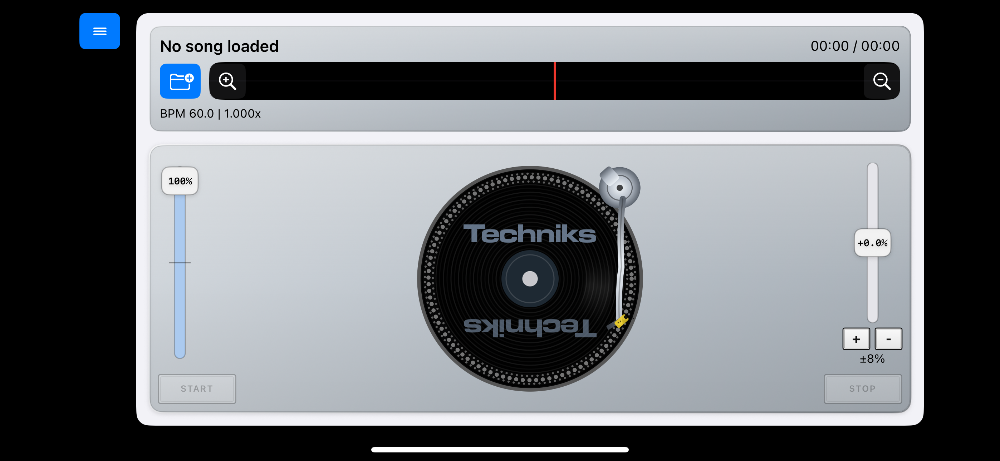
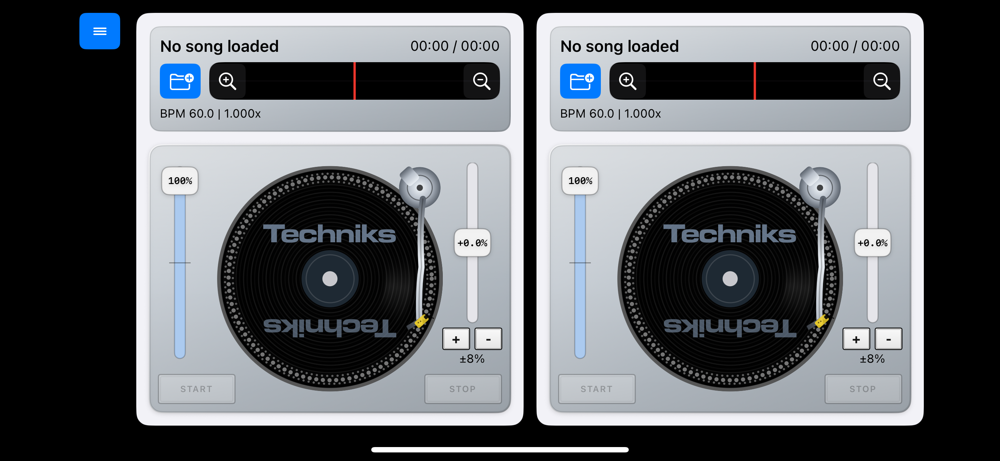
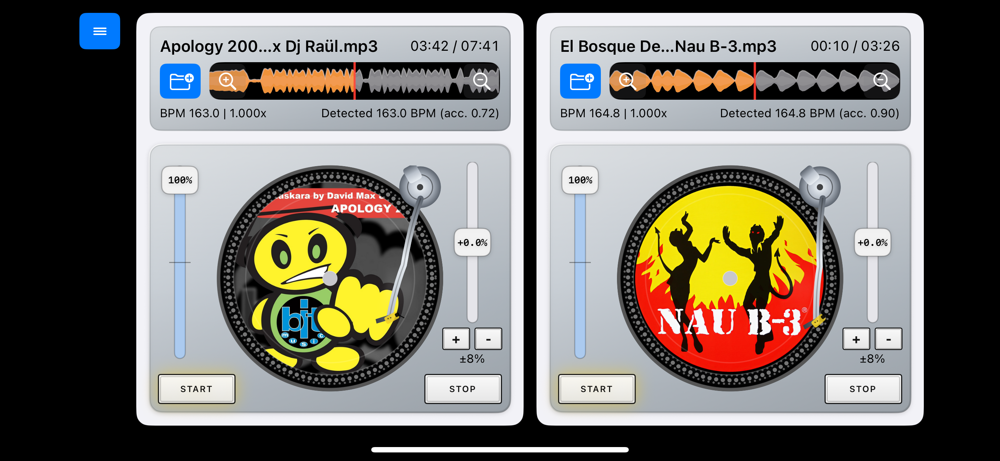
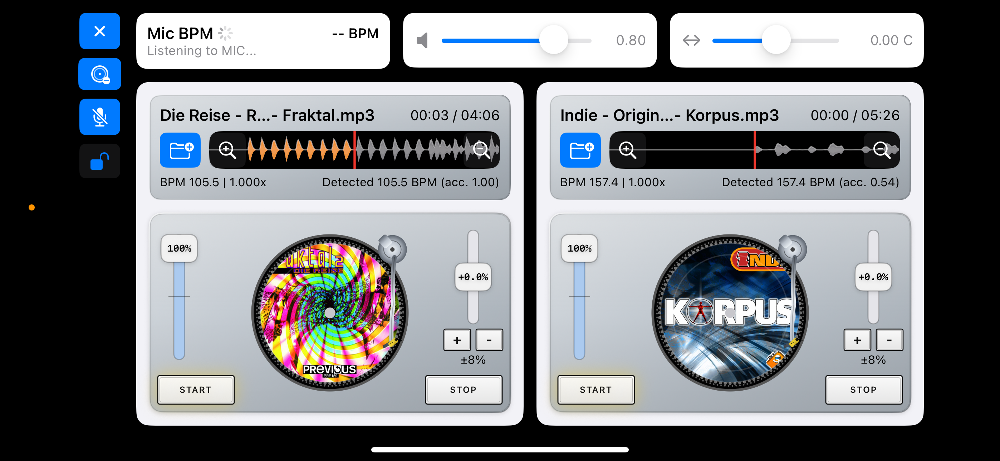

# Amateur Deejay Companion

## Description
Mixer (`dev.manelix.Mixer`) is an **amateur DJ companion app** for iOS focused on training your ear, practicing timing, and learning BPM matching basics.

It is intentionally **not a professional mixer app** and should be used for learning and practice, not for live/club performance workflows.

## Screenshots

**Single deck**

**Two decks**
 

**Loading tracks**
 

**Master buttons**

## Functionalities
- Controls column toggle (iPhone): show/hide the top controls panel.
- Controls always visible on iPad (no open/close controls button).
- Settings button: shows/hides a settings card with animated deck/control transitions.
- Right deck toggle (iPhone layout): show/hide the second deck.
- Mic BPM button: start/stop microphone tempo detection.
- Pitch lock button: lock/unlock left deck pitch to detected external BPM.
- Per-deck pan control using horizontal faders (with artwork and routing role badges).
- Split Audio Engine mode toggle in settings (standard/split behavior).
- Split deck layout selector in settings (`L:Master / R:Cue` or `L:Cue / R:Master`).
- Split cue controls line:
  - Deck `CUE` enable per deck
  - Cue mix mode horizontal fader (`left=CUE`, `center=BLEND`, `right=MASTER`)
  - Cue level horizontal fader
- Load track button: import an audio file (`mp3`, `wav`, `aiff`, `m4a`).
- Start/Pause and Stop transport buttons.
- Deck volume fader.
- Pitch fader for BPM offset with sensitivity range buttons (`+` / `-`) and thumb popover value display.
- While pitch is being adjusted, waveform shows a blurred BPM focus overlay and blocks waveform hits.
- Waveform zoom buttons (`+` / `-`) and pinch-to-zoom gesture.
- Waveform tap-to-seek gesture (tap in waveform area to seek position).
- Waveform horizontal drag gesture for scrub/scratch interaction.
- Equalizer button (always visible in controls column): show/hide per-deck EQ overlay cards.
- Per-deck 3-band equalizer overlay (`LOW`, `MID`, `HIGH`) with adaptive fader height and touch shielding over deck controls.
- EQ is connected to the audio engine (per deck):
  - `LOW`: low-shelf tuned for better audibility on compact speakers
  - `MID`: parametric band
  - `HIGH`: high-shelf band
- Turntable touch gestures:
  - circular drag to scrub/scratch audio
  - pressure/press-hold interaction to momentarily modulate playback rate
- Vertical and horizontal faders now require thumb-started drag (track taps do not reposition values).
- Bottom-centered mic listening label on deck (`Listening...` and detected `BPM`) with blinking warm glow while active.

## Limitations
- Not intended as a pro DJ platform.
- Feature scope prioritizes training over advanced performance tooling.
- Workflow and controls are simplified compared to commercial mixer software/hardware.
- Availability and behavior can vary as development phases continue.
- **This projects has been entirely built using OpenAI-Codex AI**

## License
MIT License - Free to use

Permission is hereby granted, free of charge, to any person obtaining a copy
of this software and associated documentation files (the "Software"), to deal
in the Software without restriction, including without limitation the rights
to use, copy, modify, merge, publish, distribute, sublicense, and/or sell
copies of the Software, and to permit persons to whom the Software is
furnished to do so, subject to the following conditions:

The above copyright notice and this permission notice shall be included in all
copies or substantial portions of the Software.

THE SOFTWARE IS PROVIDED "AS IS", WITHOUT WARRANTY OF ANY KIND, EXPRESS OR
IMPLIED, INCLUDING BUT NOT LIMITED TO THE WARRANTIES OF MERCHANTABILITY,
FITNESS FOR A PARTICULAR PURPOSE AND NONINFRINGEMENT. IN NO EVENT SHALL THE
AUTHORS OR COPYRIGHT HOLDERS BE LIABLE FOR ANY CLAIM, DAMAGES OR OTHER
LIABILITY, WHETHER IN AN ACTION OF CONTRACT, TORT OR OTHERWISE, ARISING FROM,
OUT OF OR IN CONNECTION WITH THE SOFTWARE OR THE USE OR OTHER DEALINGS IN THE
SOFTWARE.

## Credits

**Author**: manelix  
**GitHub**: [github.com/manelix2000](https://github.com/manelix2000)

Copyright (c) 2026 manelix
